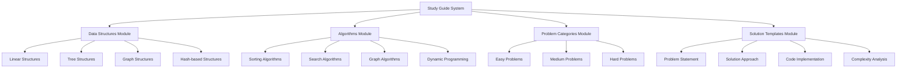

# Design Document: LeetCode Study Guide

## Overview

The LeetCode Study Guide is a comprehensive learning system designed to systematically cover all major data structures, algorithms, and problem-solving patterns commonly encountered in technical interviews and competitive programming. The system organizes content into progressive learning modules, each containing detailed explanations, implementations, and practice problems with complete solutions.

The design follows a structured approach based on the widely-recognized Blind 75 problems and extends beyond to cover additional essential topics. Each topic includes theoretical foundations, practical implementations, complexity analysis, and multiple practice problems ranging from easy to hard difficulty levels.

## Architecture

The study guide follows a modular architecture with clear separation between different learning components:



## Components and Interfaces

### 1. Data Structure Components

**Linear Data Structures:**
- Array: Static and dynamic arrays with common operations
- LinkedList: Singly, doubly, and circular linked lists
- Stack: LIFO operations with array and linked list implementations
- Queue: FIFO operations including circular queue and deque
- String: String manipulation algorithms and pattern matching

**Tree Data Structures:**
- Binary Tree: Basic tree operations and traversals (inorder, preorder, postorder)
- Binary Search Tree: Search, insert, delete operations with balancing
- AVL Tree: Self-balancing binary search tree
- Heap: Min-heap and max-heap with heap operations
- Trie: Prefix tree for string operations and autocomplete

**Graph Data Structures:**
- Graph Representation: Adjacency matrix and adjacency list
- Directed and Undirected Graphs: Basic graph operations
- Weighted Graphs: Shortest path and minimum spanning tree algorithms

**Hash-based Structures:**
- Hash Table: Hash functions and collision resolution techniques
- Hash Set: Set operations with optimal time complexity
- Hash Map: Key-value pair storage with efficient lookup

### 2. Algorithm Pattern Components

**Two Pointers Technique:**
- Same Direction: Fast and slow pointers for cycle detection
- Opposite Direction: Left and right pointers for palindrome checking
- Applications: Array problems, linked list problems, string problems

**Sliding Window Technique:**
- Fixed Size Window: Maximum sum subarray of size k
- Variable Size Window: Longest substring without repeating characters
- Applications: String problems, array problems, optimization problems

**Binary Search Pattern:**
- Classic Binary Search: Search in sorted array
- Search in Rotated Array: Modified binary search for rotated sorted arrays
- Search in 2D Matrix: Binary search in matrix with sorted properties

**Depth-First Search (DFS):**
- Tree Traversal: Recursive and iterative implementations
- Graph Traversal: Connected components and path finding
- Backtracking: Combinatorial problems and constraint satisfaction

**Breadth-First Search (BFS):**
- Level Order Traversal: Tree level-by-level processing
- Shortest Path: Unweighted graph shortest path problems
- Multi-source BFS: Problems with multiple starting points

**Dynamic Programming:**
- 1D DP: Fibonacci sequence, climbing stairs, house robber
- 2D DP: Unique paths, longest common subsequence, edit distance
- Optimization: Space optimization techniques and memoization

**Greedy Algorithms:**
- Activity Selection: Interval scheduling problems
- Huffman Coding: Optimal prefix codes
- Minimum Spanning Tree: Kruskal's and Prim's algorithms

### 3. Problem Organization Interface

**Difficulty-based Classification:**
- Easy (30% of problems): Fundamental concepts and basic implementations
- Medium (50% of problems): Intermediate problem-solving with multiple approaches
- Hard (20% of problems): Advanced algorithms and optimization techniques

**Topic-based Classification:**
- Array and String Problems: Linear data structure manipulations
- Linked List Problems: Pointer manipulation and list operations
- Tree and Graph Problems: Hierarchical and network data structures
- Dynamic Programming Problems: Optimization and recursive problem solving

## Data Models

### Problem Model
```cpp
#include <string>
#include <vector>

enum class Difficulty {
    EASY,
    MEDIUM,
    HARD
};

struct Example {
    std::string input;
    std::string output;
    std::string explanation;
};

struct TestCase {
    std::string input;
    std::string expectedOutput;
    std::string description;
};

struct CodeImplementation {
    std::string language;
    std::string code;
    std::vector<std::string> comments;
};

struct Solution {
    std::string approach;
    std::string timeComplexity;
    std::string spaceComplexity;
    std::string explanation;
    std::vector<CodeImplementation> code;
    std::vector<TestCase> testCases;
};

struct Problem {
    std::string id;
    std::string title;
    Difficulty difficulty;
    std::vector<std::string> category;
    std::vector<std::string> tags;
    std::string description;
    std::vector<std::string> constraints;
    std::vector<Example> examples;
    std::vector<Solution> solutions;
    std::vector<std::string> relatedProblems;
};
```

### Learning Path Model
```cpp
enum class LearningLevel {
    BEGINNER,
    INTERMEDIATE,
    ADVANCED
};

struct Checkpoint {
    std::string description;
    std::vector<std::string> requiredProblems;
    std::vector<std::string> assessmentCriteria;
};

struct Topic {
    std::string id;
    std::string title;
    std::string theory;
    std::vector<CodeImplementation> implementations;
    std::vector<std::string> practiceProblems;
    std::vector<Checkpoint> checkpoints;
};

struct LearningPath {
    std::string id;
    std::string title;
    std::string description;
    std::vector<std::string> prerequisites;
    std::vector<Topic> topics;
    std::string estimatedTime;
    LearningLevel difficulty;
};
```

## Correctness Properties

*A property is a characteristic or behavior that should hold true across all valid executions of a system—essentially, a formal statement about what the system should do. Properties serve as the bridge between human-readable specifications and machine-verifiable correctness guarantees.*

Based on the requirements analysis, the following correctness properties ensure the study guide meets all specified criteria:

### Property 1: Comprehensive Data Structure Coverage
*For any* major data structure (Array, LinkedList, Stack, Queue, Tree, BST, Heap, Hash Table, Graph, Trie), the study guide should include complete coverage with operations, algorithms, and implementation details.
**Validates: Requirements 1.1, 1.2, 1.3, 1.4, 1.5, 1.6, 1.7, 1.8, 1.9, 1.10**

### Property 2: Complete Algorithm Pattern Coverage  
*For any* major algorithmic pattern (Two Pointers, Sliding Window, Binary Search, DFS, BFS, Dynamic Programming, Greedy, Backtracking, Divide and Conquer, Sorting), the study guide should include comprehensive coverage with explanations and problem variations.
**Validates: Requirements 2.1, 2.2, 2.3, 2.4, 2.5, 2.6, 2.7, 2.8, 2.9, 2.10**

### Property 3: Problem Categorization Consistency
*For any* problem in the study guide, it should be properly categorized by both data structure type and algorithmic pattern, with appropriate difficulty level displayed.
**Validates: Requirements 3.1, 3.2, 3.3, 3.7**

### Property 4: Solution Completeness
*For any* solution provided in the study guide, it should include problem statement, constraints, step-by-step explanation, time complexity, space complexity, complete code implementation, and test cases.
**Validates: Requirements 4.1, 4.2, 4.3, 4.4, 4.5, 4.7**

### Property 5: Code Quality Standards
*For any* code implementation in the study guide, it should follow proper function signatures, variable naming conventions, and include comprehensive comments, all written in English.
**Validates: Requirements 5.3, 5.4, 5.5, 4.8**

### Property 6: Learning Path Progression
*For any* learning path in the study guide, topics should be ordered by increasing complexity with prerequisites covered first, and foundational data structures should precede advanced algorithms that use them.
**Validates: Requirements 6.1, 6.2, 6.3**

### Property 7: Practice Problem Integration
*For any* major topic in the study guide, it should be followed by relevant practice problems that are grouped with related problems.
**Validates: Requirements 6.4, 6.5**

## Error Handling

The study guide system should handle various error conditions gracefully:

**Content Validation Errors:**
- Missing required components in solutions (problem statement, complexity analysis, code)
- Incomplete data structure or algorithm coverage
- Incorrect categorization or difficulty assignment
- Language inconsistencies (non-English content)

**Learning Path Errors:**
- Circular dependencies in prerequisite chains
- Missing prerequisite topics
- Incorrect complexity ordering
- Orphaned topics without practice problems

**Code Quality Errors:**
- Syntax errors in code implementations
- Missing or inadequate comments
- Inconsistent naming conventions
- Missing function signatures or I/O specifications

**User Experience Errors:**
- Broken links to practice problems
- Missing examples or test cases
- Inconsistent formatting across solutions
- Inaccessible content organization

## Testing Strategy

The testing approach combines unit testing for specific content verification with property-based testing for systematic validation across all study guide components.

### Unit Testing Approach

Unit tests will verify specific examples and content requirements:

**Content Coverage Tests:**
- Verify presence of all required data structures (Array, LinkedList, Stack, etc.)
- Verify presence of all required algorithm patterns (Two Pointers, Sliding Window, etc.)
- Verify inclusion of problems across all difficulty levels (Easy, Medium, Hard)
- Verify presence of required implementation guidelines and style guides

**Solution Format Tests:**
- Test specific solutions to ensure they include all required components
- Verify code implementations compile and run correctly
- Test that complexity analyses are present and properly formatted
- Verify test cases execute successfully

**Learning Path Tests:**
- Test specific learning sequences for proper prerequisite ordering
- Verify checkpoint placement and milestone definitions
- Test that foundational topics precede advanced topics

### Property-Based Testing Approach

Property tests will validate universal characteristics across all study guide content:

**Configuration Requirements:**
- Minimum 100 iterations per property test
- Each test tagged with format: **Feature: leetcode-study-guide, Property {number}: {property_text}**
- Use Google Test framework with custom property-based testing generators

**Property Test Implementation:**
- **Property 1**: Generate random data structure selections and verify complete coverage exists
- **Property 2**: Generate random algorithm pattern selections and verify comprehensive coverage
- **Property 3**: Generate random problems and verify proper categorization and difficulty assignment
- **Property 4**: Generate random solutions and verify all required components are present
- **Property 5**: Generate random code implementations and verify quality standards compliance
- **Property 6**: Generate random learning paths and verify proper progression ordering
- **Property 7**: Generate random topics and verify associated practice problems exist

**Test Data Generation:**
- Smart generators that create realistic study guide content
- Constraint-based generation for valid problem categories and difficulty levels
- Edge case generation for boundary conditions (empty topics, missing components)

### Integration Testing

**End-to-End Learning Path Tests:**
- Verify complete learning sequences from beginner to advanced levels
- Test cross-references between related problems and topics
- Validate that all external links and resources are accessible

**Performance Testing:**
- Verify study guide generation completes within reasonable time limits
- Test content organization and search functionality performance
- Validate memory usage for large study guide datasets

The dual testing approach ensures both concrete correctness (unit tests) and universal properties (property tests) are validated, providing comprehensive coverage of all requirements while maintaining system reliability and user experience quality.